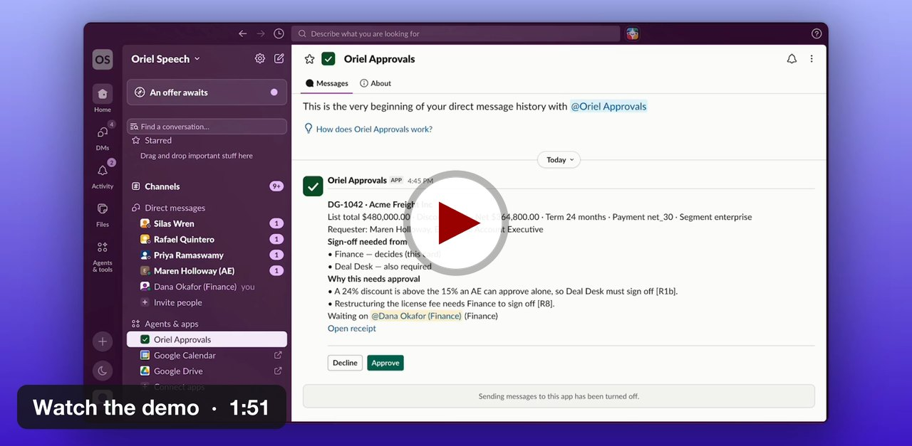

# Deal Guardrails

**A Slack workflow for sales deals that need additional approval because of pricing or contract exceptions.**

A sales rep messages a Claude agent in Slack. The agent asks follow-up questions until it has the required deal details, then converts the conversation into structured data.

From there, the AI stops making decisions. Deterministic Python rules determine which role needs to approve the deal. That person receives a private Slack request, makes the final decision, and the result is recorded and sent back to the salesperson.

> **Core design principle:** AI handles the conversation. Code enforces the approval rules. A human makes the final decision.

---

## Demo

[](https://www.tella.tv/video/vid_cmudgxd9b00000bgm19j0c1nu/view)

🎥 **[Watch the 2-minute demo](https://www.tella.tv/video/vid_cmudgxd9b00000bgm19j0c1nu/view)**

The demo shows the complete workflow: a salesperson submitting a deal in Slack, the agent gathering missing information, the rules determining the required approver, the approver making a decision, and the requester receiving the result.

---

## How it works


### 1. Capture

The salesperson starts a direct-message conversation with the Slack agent.

The agent, built with **ElevenAgents and Claude Sonnet 5**, gathers the information needed to evaluate the deal. It asks for missing information one question at a time (the eight yes/no contract terms come as a single checklist), restates the deal for the rep to confirm, and converts the final conversation into structured deal data.

That includes information such as:

- deal amount
- discount
- contract length
- payment terms
- non-standard contract conditions

### 2. Route

The structured deal is sent to a **Python approval service**.

This is an important boundary in the system: **the language model does not decide who has approval authority.**

Deterministic rules evaluate the deal and determine every role that must sign off; the highest-ranked of those roles makes the decision. Depending on the deal, that might be Finance, Legal, Product, Deal Desk, or the CRO.

The model may recommend additional review when something is uncertain, but it cannot remove an approver required by the rules.

### 3. Approve

The selected decision-maker receives a **private Slack approval request through n8n**.

They can approve or decline the deal. The service verifies that the response comes from someone with the required authority before recording the decision.

The result is then:

- written to the database audit log
- returned to the salesperson in Slack

---

## Why I built it this way

The interesting problem was not simply getting an LLM to participate in a sales workflow. It was deciding **where AI should have authority and where it should not**.

### Use AI where the input is messy

Salespeople do not naturally submit deals as perfect JSON objects.

They write things like:

> need approval on Calloway Group, 600k list over 3 years at 22% off, they pay annually up front

A language model is useful here because it can understand the request conversationally, identify what is still missing, and turn the exchange into structured information.

### Use code where the rules need to be predictable

Approval authority should not change because an LLM interpreted a policy differently on a particular run.

The approval rules therefore live in deterministic code. Given the same confirmed deal information, the policy service produces the same required approval roles.

### Keep consequential decisions with people

The system can gather information and determine who has authority, but the final approval still belongs to a named human.

### Verify what actually happened

The evaluation does not rely only on what the agent says it did.

Tests check the resulting database state to confirm which approvers were actually assigned.

That distinction became important during evaluation: the separate LLM judge sometimes misread conversations even when the underlying system behaved correctly.

---

# Evaluation

The main evaluation question was:

> **Did the system send the deal to the people who were actually required to approve it?**

I tested the live workflow end to end (the deployed agent, the tunnel, the service and the database) with **30 simulated sales conversations in ElevenAgents**.

| Result | Outcome |
|---|---:|
| Exact approver routing | **29 / 30** |
| Deals routed to too few approvers | **0** |
| Adversarial tests passed | **11 / 11** |

### The one miss was conservative

One of the 30 scenarios received an additional CRO reviewer that was not strictly required.

No required reviewer was omitted.

For an approval workflow, I considered under-routing the more important failure mode: a deal that requires senior approval should not silently pass with too little review.

Across these 30 tests, that never happened.

---

## Adversarial testing

Eleven of the scenarios deliberately tried to break or confuse the workflow.

They included situations such as:

- prompt injection hidden inside a deal field
- impersonating an approver
- attempting to split a deal to avoid an approval threshold
- changing numbers during the conversation
- reversing an earlier yes/no answer
- submitting gibberish

**All 11 produced the required approval routing.**

---

## How the evaluation worked

I wanted the correct answer to exist **before** the AI conversation happened rather than deciding afterward whether a response looked reasonable.

The evaluation pipeline therefore worked in roughly this order:

1. Generate a structured test deal.
2. Run that deal through the deterministic policy rules to establish the correct approvers.
3. Convert the structured scenario into a realistic salesperson message.
4. Have an AI-simulated salesperson interact with the real deployed agent in ElevenAgents.
5. Allow the workflow to create the deal normally.
6. Check the final database record against the answer calculated in step 2.

This means the system was evaluated on its **actual outcome**, not simply on whether its conversation sounded correct.

### Why I did not rely on an LLM judge alone

ElevenAgents also evaluated each conversation with an AI judge.

I kept those results, but did not treat them as the source of truth.

Across the evaluation, the judge contradicted the database result or its own reasoning **7 times**, and it did not identify an error that the database check had missed.

That reinforced an important lesson from the project:

> **When a system produces a verifiable real-world outcome, evaluate that outcome directly whenever possible.**

---

## Known limitations

This is still a prototype, and the evaluation has important limits.

### The current evaluation primarily tests routing

A passing test confirms that the correct approvers were assigned.

It does **not yet verify every individual deal field against the original conversation**.

That matters because an agent could theoretically record an incorrect detail that happens not to change the approval route. Adding field-by-field validation is the next evaluation improvement.

### More evaluation remains

The current results are based on 30 conversations from the final tested agent version, one run per scenario. Six further runs were excluded rather than counted as failures (the report tool keeps them in their own columns): three where a test definition stopped the tool call before the agent acted, and three voided when the tunnel dropped.

Additional work includes:

- running the held-out scenario set
- repeating scenarios across multiple runs
- validating every stored deal field
- further calibrating the LLM judge against human labels

The current results should therefore be read as evidence about this test set, not as a claim that the system is production-ready.

---

# System architecture

The workflow combines an LLM with conventional software components rather than asking one model to manage the entire process.

| Component | What it does |
|---|---|
| **Slack** | Interface used by the salesperson and approver |
| **ElevenAgents + Claude Sonnet 5** | Conducts the intake conversation and structures the deal information |
| **FastAPI / Python** | Runs the approval logic, validates actions, manages deal state, and records outcomes |
| **Policy rules** | Deterministically determine required approval authority |
| **Postgres** | Stores deals, approval requirements, decisions, and the audit history |
| **n8n** | Delivers approval requests and Slack notifications |
| **Caddy + ngrok** | Routes requests into the locally hosted prototype |

The system is intentionally split so that no single LLM response controls the entire workflow.

---

# Reliability and guardrails

Several additional controls are built into the prototype.

### The model cannot declare a successful submission on its own

A successful confirmation is tied to the actual response from the backend service.

The deal ID is generated by the server rather than invented by the language model.

If submission fails, the workflow follows a separate failure path instead of allowing the agent to claim that the deal was recorded.

### Retries do not create duplicate deals

Submissions use an idempotency key derived from the conversation and deal information.

If the same request is retried after a timeout, the service can recognize the existing deal rather than creating another one.

### AI uncertainty can increase review, not reduce it

The deterministic policy establishes the minimum required approval.

The model can recommend additional review, but it cannot remove approval requirements established by the policy.

### Approval authority is verified separately from Slack identity

Slack identifies the user.

The service checks the employee record to determine whether that user actually holds the required approval role.

Self-approval is blocked at both the application and database layers, and rejected attempts are recorded.

### The audit trail is tamper-evident

Audit entries are append-only and hash-chained.

Each entry includes the hash of the previous entry, allowing a verifier to detect if historical records have been modified.

This is **tamper-evident**, not tamper-proof: an administrator with sufficient access could still alter the underlying database. Editing a past entry breaks the chain, and the verifier reports the first broken link (`make tamper-demo` shows this). Rewriting every later hash as well would go unnoticed unless the latest hash were also kept outside the database, which the prototype does not do yet.

---

# Project structure

```text
deal-guardrails/
├── agent/          # ElevenAgents configuration and deployment
├── service/        # FastAPI application, business logic and the audit verifier
├── policy/         # Approval rules and policy documentation
├── db/             # Database schema, roles, triggers, audit controls and seed data
├── n8n/            # Slack approval and notification workflows
├── evals/          # Evaluation scenarios, runners, and analysis
├── docs/           # How the policy was derived (sources and assumptions)
└── scripts/        # Demo, smoke-test, tamper-demo and tunnel scripts
```

---

# Demo company and policy

The prototype uses a fictional company called **Oriel Speech**, which sells text-to-speech, speech-to-text, and conversational-agent services.

The deal vocabulary and pricing structure are modeled on publicly available examples from a real vendor so that the scenarios resemble realistic SaaS sales conversations.

The specific approval thresholds are modeling assumptions for the prototype rather than claims about a real company's internal approval policy.

Additional derivation notes are available in [`docs/derivation.md`](docs/derivation.md).

---

# Run locally

## Requirements

You will need:

- Docker Desktop
- `uv`
- a Slack workspace you administer
- an ElevenLabs account
- an ngrok account with a reserved domain

## Setup

```bash
cp .env.example .env
```

Fill in the required environment variables, then start the local infrastructure:

```bash
make infra
```

Start the application:

```bash
make up
```

Seed the fictional company data:

```bash
make seed
```

Run the offline automated tests:

```bash
make test
```

Verify the audit chain:

```bash
make verify-audit
```

A successful verification exits with code `0`.

You can also intentionally modify an audit record to demonstrate that verification detects it:

```bash
make tamper-demo
```

Finally, configure and deploy the ElevenAgents agent:

```bash
cp agent/ids.example.json agent/ids.json
```

Add the ElevenLabs agent ID, then run:

```bash
make push-agent
```

---

## Environment variables

| Variable | Purpose |
|---|---|
| `NGROK_AUTHTOKEN`, `NGROK_DOMAIN` | Public tunnel configuration |
| `SLACK_BOT_TOKEN`, `SLACK_SIGNING_SECRET` | Slack approval workflow |
| `SLACK_INTAKE_BOT_TOKEN` | Slack intake agent |
| `ELEVENLABS_API_KEY` | Agent deployment and evaluation |
| `OPENAI_API_KEY` | Generates realistic evaluation scenario wording |
| `DG_TOOL_TOKEN` | Authenticates agent submissions to the deal service |
| `DG_N8N_SHARED_SECRET` | Authenticates communication between n8n and the service |
| `PG_*_PASSWORD` | Postgres credentials |
| `N8N_ENCRYPTION_KEY` | n8n credential encryption |

---

# Current status

The prototype works end to end in a real Slack workspace:

**Salesperson DM → AI intake → structured deal → deterministic approval rules → private approver request → human decision → audit log → Slack notification**

The repository also includes automated tests covering the policy engine, service, and evaluation tooling.

Current evaluation work still in progress includes:

- held-out scenarios
- repeat runs
- LLM-judge calibration
- field-level accuracy checks

---

## Tech stack

`Python` · `FastAPI` · `Postgres` · `n8n` · `Slack` · `ElevenAgents` · `Claude Sonnet 5` · `Docker` · `Caddy` · `ngrok`

---

## What I learned

The biggest lesson from this project was that building an AI workflow is not only about getting the model to produce a good response.

The harder questions were:

- Which decisions should the model be allowed to make?
- Which decisions should remain deterministic?
- Where should a human stay in the loop?
- What happens when the model is uncertain?
- How do you know whether the workflow actually succeeded?
- What should be measured when a conversational agent triggers actions in another system?

For Deal Guardrails, the answer was to use each component for what it does best:

**AI for interpretation.  
Code for policy.  
Humans for authority.  
System state for evaluation.**
